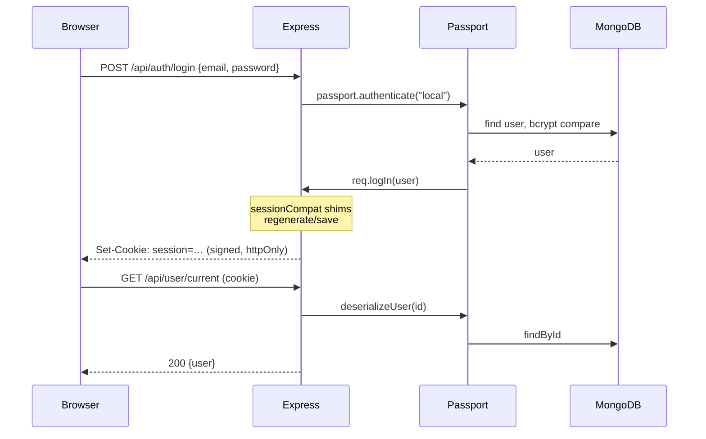

# Auth and Sessions

Cookie sessions, passport local strategy. **No JWT anywhere.**

## The flow



## Pieces

| File | Role |
|---|---|
| `config/passport.config.ts` | Local strategy, `serializeUser` / `deserializeUser` |
| `middlewares/isAuthenticated.middleware.ts` | 401 if `req.user` is absent |
| `middlewares/sessionCompat.middleware.ts` | The shim that makes passport 0.7 work with cookie-session |
| `utils/bcrypt.ts` | Hash and compare |

## Session cookie settings

```ts
session({
  name: "session",
  keys: [config.SESSION_SECRET],
  maxAge: sessionHours * 60 * 60 * 1000,   // SESSION_EXPIRES_IN, hours
  secure: config.NODE_ENV === "production",
  httpOnly: true,
  sameSite: "lax",
})
```

`SESSION_EXPIRES_IN` is **in hours** and falls back to 24 if it is missing or
not a positive number, so a bad value degrades instead of producing a `NaN`
`maxAge`.

`secure: true` in production is exactly what makes [[Trust Proxy and Secure Cookies]]
matter. `sameSite: "lax"` works in production because the client and API share
one origin — see [[Deploying to DigitalOcean]].

## Two failure modes worth memorising

1. **`req.session.regenerate is not a function`** on login →
   [[cookie-session and Passport 0.7]]
2. **Login returns 200, no `Set-Cookie`, everything 401s afterwards** →
   [[Trust Proxy and Secure Cookies]]

A third, in development only: a **401 flood on `/api/user/current`** is almost
always an origin mismatch, not an auth bug → [[CORS and Credentials]].

## Google OAuth

Commented out, not deleted. Every disabled block is marked:

```ts
// --- Google OAuth (disabled) ---
```

They appear in `app.config.ts`, `passport.config.ts`, `auth.route.ts`,
`routePaths.ts`, `routes.tsx`, and the sign-in/sign-up pages. The env vars
`GOOGLE_CLIENT_ID`, `GOOGLE_CLIENT_SECRET`, `GOOGLE_CALLBACK_URL` and
`FRONTEND_GOOGLE_CALLBACK_URL` are still in `.env` but unread. To re-enable,
search that comment string and uncomment each site.

## Related

- [[Backend]] · [[Environment Variables]] · [[Permissions and Roles]]
