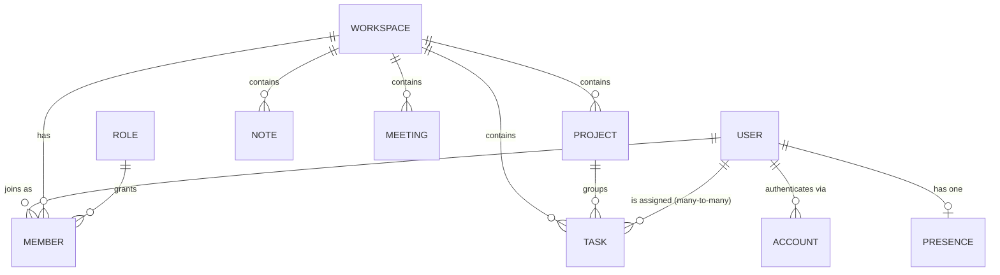

# Data Model

Ten collections. Everything is scoped to a workspace.



## The join table

`Member` is the centre of the model: `{ userId, workspaceId, role, joinedAt }`.
A user's rights are never on the user — they are on the membership. This is why
[[Permissions and Roles]] resolves the role per request from `MemberModel`, and
why the role seeder must never change a role's `_id`
([[Role Seeding Must Preserve _id]]).

## Collections

### User
`name, email, password?, profilePicture, isActive, lastLogin, currentWorkspace`
Methods `comparePassword` and `omitPassword`. Password is bcrypt-hashed in a
pre-save hook and is optional because an OAuth account would not have one.

### Account
`provider, providerId, userId, refreshToken, tokenExpiry`. Providers come from
`account-provider.enum.ts`. Currently only the local/email path is live —
see [[Auth and Sessions]].

### Workspace
`name, description, owner, inviteCode`. The invite code is a short uuid used by
`POST /api/member/workspace/:inviteCode/join`.

### Role
`{ name: OWNER | ADMIN | MEMBER, permissions: PermissionType[] }`. Three
documents, seeded. Referenced by `Member.role`. See [[Permissions and Roles]].

### Project
`name, description, emoji, workspace, createdBy`.

### Task
```
taskCode, title, description, project, workspace,
status, priority, size,
assignedTo: ObjectId[],   ← an ARRAY
createdBy, dueDate
```
`assignedTo` became an array when multi-assignee landed. Existing scalar values
are converted by `npm run migrate:assignees` — see [[Seeders and Migrations]]
and the trap in [[Array Queries Match Element-wise]]. Enums live in
`enums/task.enum.ts`; details in [[Tasks]].

### Note
`userId, workspaceId, title, content, visibility, sharedWith[]`. `content` is
sanitised HTML. See [[Notes]].

### Meeting
`userId, workspaceId, title, description, startAt, endAt, meetingLink,
location, visibility, sharedWith[]`. See [[Meetings]].

### Presence
`userId, lastSeenAt, sessionStartedAt, activeMsToday, activeDate`.
One document per user, updated by an aggregation pipeline. See [[Presence]].

## Visibility

`Note` and `Meeting` share `enums/visibility.enum.ts`:

- `PRIVATE` — only the creator
- `SHARED` — the creator plus the specific members in `sharedWith`

Sharing is **per item and opt-in**. An owner or admin cannot read someone's
private notes — there is no workspace-wide override, by design.

## Related

- [[Backend]] · [[Permissions and Roles]] · [[Tasks]] · [[Notes]] · [[Meetings]]
