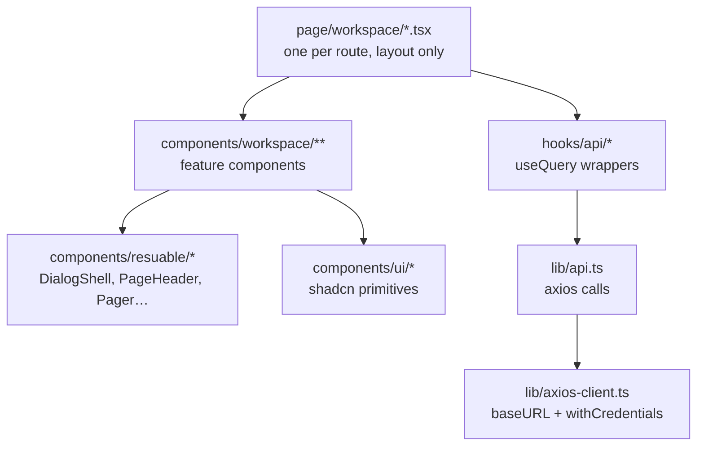

# Frontend

Vite 6 + React 18 + TypeScript. Path alias `@` → `client/src`.

## The stack, and what each piece owns

| Concern | Tool | Notes |
|---|---|---|
| Server state | **TanStack Query v5** | Every fetch. Query keys include the workspace id and all filters |
| Forms | **react-hook-form + zod** | `zodResolver`, schemas declared inside the component |
| URL state | **nuqs** | Dialog open/close (`?new-workspace=true`), table filters |
| Routing | **react-router-dom 7** | Paths centralised in `routes/common/routePaths.ts` |
| UI primitives | **shadcn/ui + Radix** | `components/ui/`, owned in-repo, edit freely |
| Styling | **Tailwind 3** | `darkMode: ["class"]`, HSL custom-property tokens — [[Theming]] |
| Table | **TanStack Table v8** | `components/workspace/task/table/` |
| Rich text | **TipTap 2** | [[Notes]] |
| Dates | **date-fns 3** | Including the hand-built calendar in [[Meetings]] |

## Layers



Pages are thin. If a page has logic beyond composing a header and a body, that
logic belongs in a feature component.

## Auth and permissions on the client

`context/auth-provider.tsx` runs two queries — the current user and the current
workspace — and derives permissions from the caller's membership:

```ts
const permissions = usePermissions(user, workspace);
const hasPermission = (p) => permissions.includes(p);
```

Two consumers:

- `hoc/with-permission.tsx` — gates a whole route. **It must wait for both
  queries**; permissions come from the workspace, so deciding before that query
  settles always says "denied". This was a real bug.
- `components/resuable/permission-guard.tsx` and inline `hasPermission` calls —
  hide individual controls, e.g. Delete in the task row menu.

> [!warning] Client gating is cosmetic
> Hiding a button is a courtesy, not security. Every permission is enforced
> again server-side by `roleGuard`. See [[Permissions and Roles]].

## Query keys

Include everything that changes the result, or you will serve one workspace's
data to another:

```ts
["all-tasks", workspaceId, filters, pageNumber, pageSize, mine]
```

The `mine` flag is what separates [[Tasks]] from My Tasks while reusing one
component.

## A rule learned the hard way

**Never fix a lint `set-state-in-effect` error by adding another effect.** Derive
during render, or remount on open with `key` + a lazy `useState` initialiser.
This pattern shows up in every dialog that seeds its form from a prop.

## Related

- [[System Overview]] · [[Design System]] · [[Theming]] · [[Permissions and Roles]]
