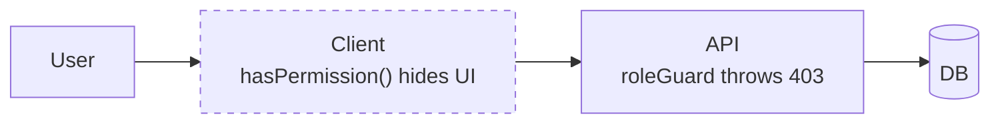

# Permissions and Roles

Three roles, sixteen permissions, defined in `backend/src/enums/role.enum.ts`
and composed in `backend/src/utils/role-permission.ts`.

## The matrix

| Permission | OWNER | ADMIN | MEMBER |
|---|:-:|:-:|:-:|
| `CREATE_WORKSPACE` | ✅ | | |
| `EDIT_WORKSPACE` | ✅ | | |
| `DELETE_WORKSPACE` | ✅ | | |
| `MANAGE_WORKSPACE_SETTINGS` | ✅ | ✅ | |
| `ADD_MEMBER` | ✅ | ✅ | |
| `CHANGE_MEMBER_ROLE` | ✅ | | |
| `REMOVE_MEMBER` | ✅ | | |
| `CREATE_PROJECT` | ✅ | ✅ | |
| `EDIT_PROJECT` | ✅ | ✅ | |
| `DELETE_PROJECT` | ✅ | ✅ | |
| `CREATE_TASK` | ✅ | ✅ | ✅ |
| `EDIT_TASK` (any task) | ✅ | ✅ | |
| `EDIT_OWN_TASK` | ✅ | ✅ | ✅ |
| `DELETE_TASK` | ✅ | ✅ | |
| `VIEW_ALL_TASKS` | ✅ | ✅ | |
| `VIEW_ONLY` | ✅ | ✅ | ✅ |

A **member** is deliberately narrow: create tasks, edit the ones they own or are
assigned to, and nothing else. They never see the whole workspace backlog. Their
home is the My Tasks page — see [[Tasks]].

## The two task permissions that branch

`EDIT_TASK` vs `EDIT_OWN_TASK` and the presence or absence of `VIEW_ALL_TASKS`
are resolved in `task.controller.ts`, not by a single `roleGuard` call:

```ts
const permissions = RolePermissions[role as RoleType];

// update
const canEditAny = permissions.includes(Permissions.EDIT_TASK);
if (!canEditAny) roleGuard(role, [Permissions.EDIT_OWN_TASK]);
updateTaskService(..., canEditAny ? undefined : { userId: String(userId) });

// list
const canViewAll = permissions.includes(Permissions.VIEW_ALL_TASKS);
const wantsMine = req.query.mine === "true";
if (!canViewAll || wantsMine) filters.onlyForUserId = String(userId);
```

"Own" means created-by **or** assigned-to, built by `ownTaskFilter`:

```ts
{ $or: [{ createdBy: id }, { assignedTo: id }] }
```

Combined into the query with `$and` so it composes with the other filters
instead of replacing them.

## Enforcement, both ends



The dashed box is **cosmetic only**. Hiding the Delete item in the row menu
stops an honest mistake; it stops nothing else. Server-side, every mutating
controller resolves the caller's membership with `getMemberRoleInWorkspace` and
calls `roleGuard(role, [Permissions.X])`, which throws `UnauthorizedException`.

## Changing the matrix

Editing `role-permission.ts` changes nothing until the roles are re-seeded:

```powershell
cd backend; npm run seed
```

Read [[Role Seeding Must Preserve _id]] before you run it — the original seeder
would have detached every membership.

## Related

- [[Data Model]] · [[Tasks]] · [[Backend]] · [[Frontend]] · [[Seeders and Migrations]]
