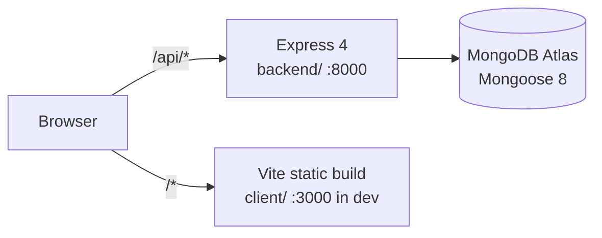
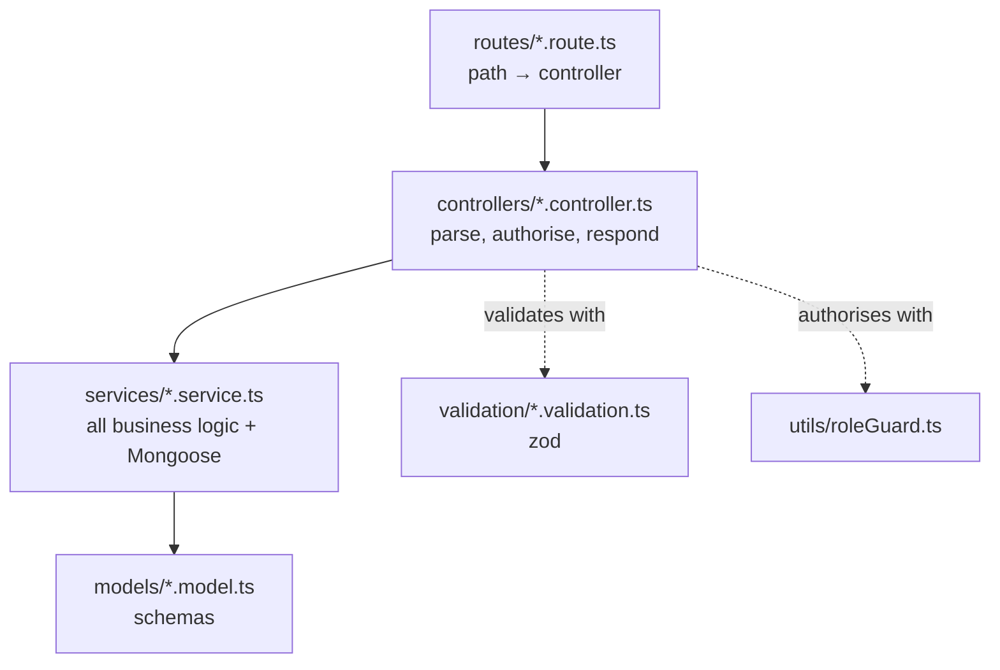

# System Overview

Two deployables, one domain in production.



In development these are two origins and CORS matters — see
[[CORS and Credentials]]. In production both sit behind one DigitalOcean domain
and the client calls a **relative** `/api`, which removes CORS entirely. See
[[Deploying to DigitalOcean]].

## The layers



The rule that holds everywhere: **controllers never touch Mongoose, services
never touch `req`/`res`.** A controller pulls values off the request, validates
them with zod, resolves the caller's role, calls one service, and shapes the
response. Everything else lives in the service. See [[Backend]].

## What a request carries

Every authenticated route group is mounted with the same three-part prefix:

```ts
app.use(`${BASE_PATH}/task`, isAuthenticated, touchPresence, taskRoutes);
```

- `isAuthenticated` — rejects with 401 unless passport rehydrated a user
- `touchPresence` — fire-and-forget activity write, throttled ([[Presence]])
- the router itself

`/api/auth/*` is the only group without those, for obvious reasons. `/health` is
deliberately dependency-free because `/` throws on purpose.

## Adding a feature

The shape is the same every time, and following it is most of the work:

1. `enums/` if there is a new closed set of values
2. `models/<thing>.model.ts` — schema + a `Document` interface
3. `validation/<thing>.validation.ts` — zod schemas for every body and param
4. `services/<thing>.service.ts` — the logic, throwing `AppError` subclasses
5. `controllers/<thing>.controller.ts` — wrapped in `asyncHandler`
6. `routes/<thing>.route.ts` — and mount it in `index.ts`
7. Client: a hook in `hooks/api/`, an API function in `lib/api.ts`, a page in
   `page/workspace/`, a route in `routes/common/`

[[Notes]] and [[Meetings]] are the cleanest examples to copy — both were built
top-to-bottom in that order.

## Related

- [[Backend]] · [[Frontend]] · [[Data Model]] · [[API Endpoints]]
