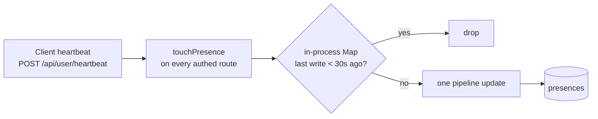

# Presence

Online / last-seen / time-active-today on the Members page, without hammering
the database, the server, or the client.

`backend/src/services/presence.service.ts`,
`backend/src/middlewares/touchPresence.middleware.ts`,
`client/src/hooks/use-presence-heartbeat.ts`.

## The constants

```ts
PRESENCE_WRITE_THROTTLE_MS = 30_000    // at most one write per user per 30s
PRESENCE_ONLINE_WINDOW_MS  = 150_000   // seen within 2.5 min ⇒ "online"
PRESENCE_SESSION_GAP_MS    = 300_000   // 5 min of silence starts a new session
```

The online window is deliberately several times the heartbeat interval, so one
dropped request does not flicker someone offline.

## Three layers of throttling



1. **The client** only beats while the tab is alive and the user is signed in.
2. **`touchPresence`** rides along on *every* authenticated request, so
   ordinary use keeps presence fresh with no extra traffic at all.
3. **The in-process `lastWriteAt` Map** collapses everything down to one write
   per user per 30 seconds.

That last one is why the whole thing is cheap: a burst of twenty API calls
produces exactly one presence write.

> [!note] Fire-and-forget on purpose
> ```ts
> recordPresence(String(userId)).catch(() => { });
> ```
> The empty catch is **load-bearing**. Presence is telemetry — a failed write
> must never turn a working request into a 500, and must not log noise on every
> hiccup. This is intentional, not a swallowed error to "fix".

## The write

One aggregation-pipeline update, `buildPresenceUpdatePipeline` (exported for
testing). Inside the database it decides, atomically:

- whether the gap since `lastSeenAt` exceeds `PRESENCE_SESSION_GAP_MS` — if so
  `sessionStartedAt` resets, otherwise the elapsed time is added to
  `activeMsToday`
- whether the UTC day rolled over — if so `activeMsToday` resets and
  `activeDate` advances

Doing it in a pipeline avoids a read-modify-write race between concurrent
requests from the same user.

## Reading it

`GET /api/workspace/presence/:id` returns one row per member plus the window
used, so the client does not hardcode the threshold:

```ts
{ onlineWindowMs, presence: [{ userId, online, lastSeenAt,
                               sessionStartedAt, activeMsToday }] }
```

`client/src/lib/presence.ts` formats it: a green dot and "Active now", or
"Last active 42 minutes ago", plus today's active total.

## Related

- [[Backend]] · [[Data Model]] · [[API Endpoints]]
