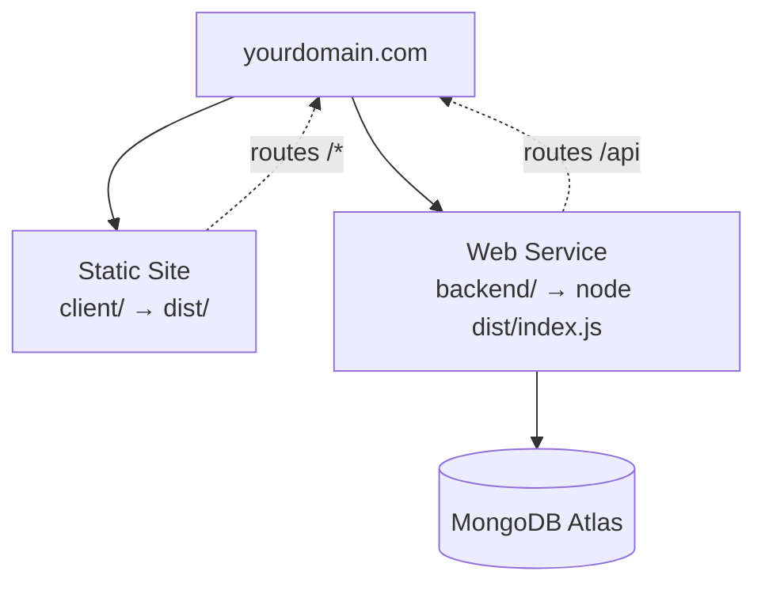

# Deploying to DigitalOcean

Target: **App Platform**, both components under **one domain**.



One domain is the whole trick. Because the SPA calls a **relative** `/api`:

- no CORS preflight, and no `FRONTEND_ORIGIN` to keep in sync
- the session cookie is first-party, so `sameSite: "lax"` just works
- the same build artifact works on any domain without rebuilding

## The client needs no environment configuration

`client/.env.production` already contains `VITE_API_BASE_URL=/api`, and Vite
inlines it at build time. Nothing to set in the App Platform UI for the static
site.

## Checklist

- [ ] **Static site** — source dir `client`, build `npm run build`, output `dist`
- [ ] **Web service** — source dir `backend`, build `npm run build`, run
      `node dist/index.js`
- [ ] Route the web service at `/api` with **`preserve_path_prefix: true`**.
      Without it App Platform strips `/api` before forwarding, Express (mounted
      under `BASE_PATH=/api`) never matches, and every call 404s
- [ ] Health check → **`/health`**, never `/` (it throws on purpose)
- [ ] `NODE_ENV=production` as a **run-time** variable, not build-time. As a
      build variable it makes npm skip devDependencies and `tsc` is missing
- [ ] `SESSION_SECRET`, `MONGO_URI` as encrypted run-time variables
- [ ] `PORT` — App Platform injects it; do not hardcode
- [ ] Atlas: allowlist the App Platform egress IPs, not `0.0.0.0/0`
- [ ] Rotate the Atlas password committed in `b0c5e2f`
- [ ] Rename the database — it is currently called `test`

## Why `trust proxy` matters here specifically

App Platform terminates TLS and forwards to Node over plain HTTP. Without
`app.set("trust proxy", 1)`, `req.protocol` is `"http"`, and the `cookies`
library refuses to send a `secure` cookie over what it believes is an
unencrypted connection. cookie-session swallows that into a debug log, so login
returns **200 with no `Set-Cookie`** and every later request 401s, with nothing
in the logs.

This is already set in `index.ts`. Do not remove it. Full write-up:
[[Trust Proxy and Secure Cookies]].

## First deploy

```powershell
cd backend; npm run seed
```

Run against the production `MONGO_URI` to create the three roles. It is
idempotent — [[Seeders and Migrations]].

## Related

- [[Environment Variables]] · [[Auth and Sessions]] · [[CORS and Credentials]]
