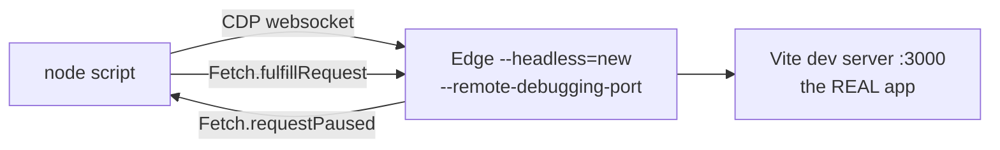

# Verification Harness

There is no test framework in this repo. What there is instead: a set of
throwaway Node scripts that drive **the real app in a real headless browser**
over the Chrome DevTools Protocol, with API responses intercepted and replaced
by fixtures.

They live in the session scratchpad, not in the repo. The pattern matters more
than the files.

## Why it exists

A build that passes says nothing about whether a page renders correctly. Several
real bugs in this project were invisible to TypeScript and ESLint and visible
immediately on screen:

- the task table's Size column clipped off the right edge
- `withPermission` bouncing users who *did* have the permission
- the first Meridian logo being the London Underground roundel
- a dialog's submit button at y=1016 in an 800px window

## How it works



1. Launch Edge headless with `--remote-debugging-port=<n>` and a dedicated
   `--user-data-dir`
2. Connect to `/json/list` over HTTP, then to the page's
   `webSocketDebuggerUrl` using Node's **built-in** `WebSocket` (no `ws`
   dependency)
3. `Fetch.enable` with `urlPattern: "*localhost:8000/api/*"`
4. On `Fetch.requestPaused`, match the URL against a fixture table and
   `Fetch.fulfillRequest`

No session, no database, no writes. The app believes it is logged in.

## The CORS trap in the harness itself

Fulfilled responses must carry an **exact** origin and
`Access-Control-Allow-Credentials: true`. A wildcard makes the browser discard
every response and the app looks logged out — which once sent me hunting a bug
in the app that was really in my own test rig.

```js
const CORS = [
  { name: "Access-Control-Allow-Origin", value: "http://localhost:3000" },
  { name: "Access-Control-Allow-Credentials", value: "true" },
  { name: "Access-Control-Allow-Headers", value: "content-type" },
  { name: "Access-Control-Allow-Methods", value: "GET,POST,PUT,DELETE,OPTIONS" },
];
```

Answer `OPTIONS` with a 204 + those headers before anything else.

## Two flavours

**Responsive sweep** — every page × every viewport, screenshot each, and report
`document.scrollWidth` vs `window.innerWidth` plus any control rendered past the
right edge that is *not* inside a horizontally scrollable ancestor. That last
qualifier matters: a table that scrolls sideways is fine, a button off-screen is
not.

**Functional drive** — click through a real flow and assert on the captured
request body. Notes and Tasks both have one. Radix specifics:

- dropdown triggers open on **pointerdown**; a synthetic `.click()` misses them.
  Use `Input.dispatchMouseEvent` with `mousePressed`/`mouseReleased`
- `cmdk` items are `[cmdk-item]`
- set React-controlled inputs through the native value setter, then dispatch
  `input` with `bubbles: true`

## Fixture accuracy is load-bearing

`GET /workspace/:id` returns members with `userId` as a plain **string**, while
`GET /workspace/members/:id` returns it **populated**. `usePermissions` matches
the string form. Getting that wrong in a fixture makes every permission check
fail and looks exactly like a permissions bug.

Set `ROLE=member` to reproduce a member's view — a smaller permission list,
which is how the Delete-hidden and nav-hidden behaviour was confirmed.

## The discipline

> [!important] Verify, don't assert
> Two of the bugs this rig found were **in the tests, not the app**: an XSS
> assertion that flagged the harmless string `alert(1)` inside correctly
> escaped output, and a member-picker regex that collapsed to `RegExp("")` and
> matched the first item every time. A failing check is a hypothesis about
> either side. See also the false-passing assertion in
> [[Seeders and Migrations]].

Backend features get the same treatment against a **throwaway database that is
created and dropped**, never application collections.

## Related

- [[Local Development]] · [[Design System]] · [[Seeders and Migrations]]
